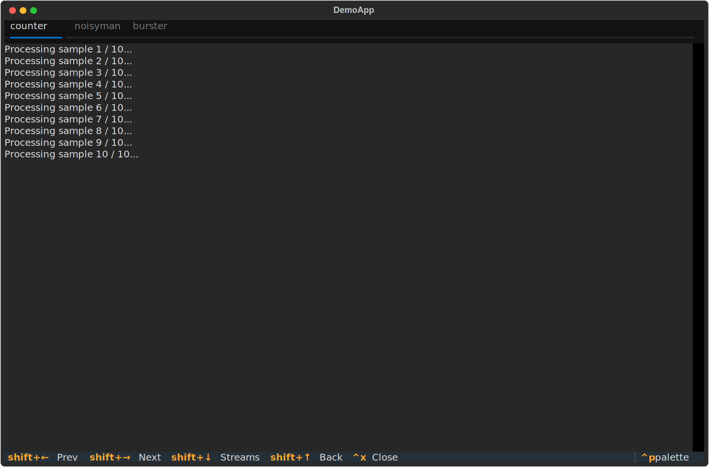

# panelview



TUI for watching multiple subprocesses in parallel. Each process gets a full-window browser-style tab with independent stdout/stderr views and live scrollable output.

## Install

```bash
make venv
# or manually:
python3 -m venv .venv && .venv/bin/pip install -e .
```

Requires Python 3.11+ and [textual](https://github.com/Textualize/textual) ≥ 8.

## Try it

```bash
make demo       # three processes: counter, stdout+stderr alternator, fast burst
make demo-fail  # same but one process exits non-zero — shows failed state
```

## Usage

### CLI

Each positional argument is a shell command. Use `-t`/`--title` before a command to name its tab:

```bash
panelview "cmd1 arg" "cmd2 arg"

panelview -t align   "bwa mem ref.fa reads.fq > out.bam" \
          -t count   "featureCounts -a genes.gtf out.bam -o counts.txt" \
          -t fastqc  "fastqc reads.fq"
```

Without `-t`, tabs are numbered `Process 1`, `Process 2`, etc.

### Python API — static (all processes known upfront)

```python
from panelview import PanelRunner

runner = PanelRunner()
runner.add("bwa mem ref.fa reads.fq > out.bam", title="align")
runner.add("featureCounts -a genes.gtf out.bam -o counts.txt", title="count")
runner.run()
```

### Python API — dynamic (add processes as they are created)

The TUI must stay on the main thread (Python signal constraint). Pass a callback to `run_with()`; it runs in a background thread and receives `add_live` for spawning new tabs:

```python
import time
from panelview import PanelRunner

def pipeline(add_live):
    time.sleep(3)                          # wait for stage-1 to finish
    add_live("cmd_stage2a", title="2a")
    add_live("cmd_stage2b", title="2b")
    time.sleep(3)                          # wait for stage-2 to finish
    add_live("cmd_stage3",  title="3")

runner = PanelRunner()
runner.add("cmd_stage1a", title="1a")
runner.add("cmd_stage1b", title="1b")
runner.run_with(pipeline)                  # blocks until TUI is closed
```

See `examples/demo_live.py` for a runnable pipeline simulation.

## Keys

Each process occupies a full-window tab. There are two navigation modes:

**Tab mode** (default)

| Key | Action |
|-----|--------|
| `Shift+←` / `Shift+→` | Switch to previous / next tab |
| `Shift+↓` | Enter stream-select mode for the current tab |
| `↑` `↓` `PgUp` `PgDn` | Scroll output up / down |
| `Ctrl+C` | Open stop menu (kill current / kill all / exit) |
| `Ctrl+X` | Kill current process and close its tab |

**Stream-select mode** (entered with `Shift+↓`)

| Key | Action |
|-----|--------|
| `Shift+←` | Switch to stdout |
| `Shift+→` | Switch to stderr |
| `Shift+↑` | Return to tab mode |

A bar appears at the top of the panel showing the active stream while in stream-select mode.

## Stop menu (`Ctrl+C`)

Opens a modal with three choices (arrow keys + `Enter` to select, `Escape` to cancel):

- **Send SIGTERM to current process** — stop the focused tab's process
- **Send SIGTERM to all processes** — stop everything
- **Kill all and exit** — SIGTERM all processes and quit panelview

## Tab states

Finished processes keep their tab; the tab title gains a suffix:

| Suffix | Meaning |
|--------|---------|
| `[done 0]` | Exited cleanly |
| `[failed N]` | Exited with code N |

Use `Ctrl+X` to explicitly close and remove a tab.
